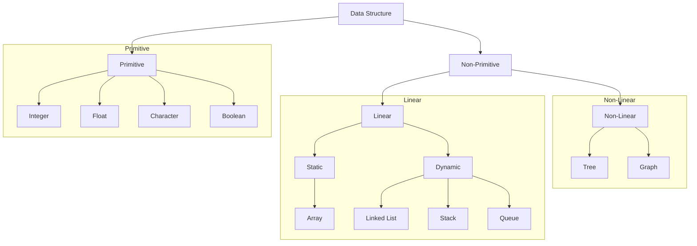
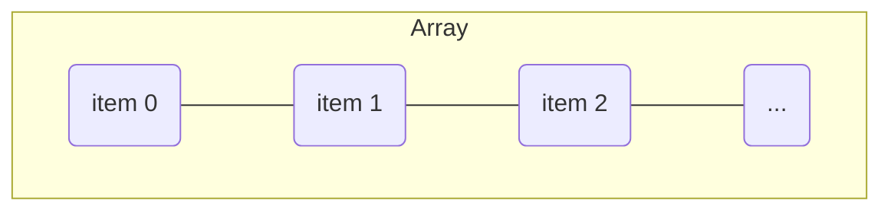
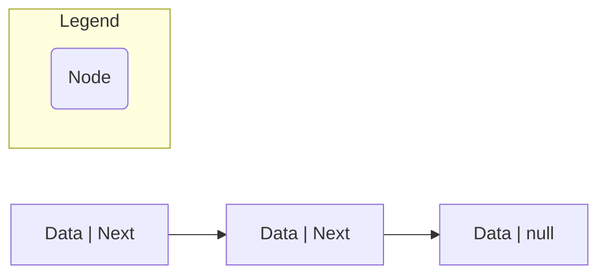
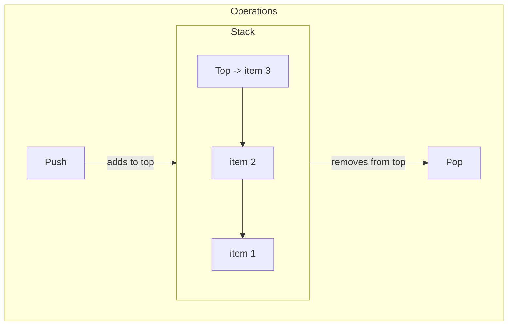
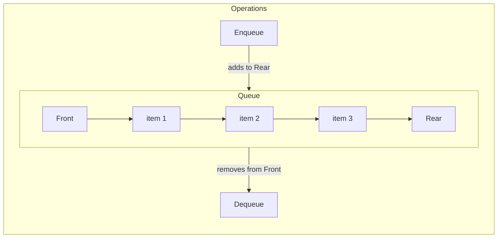
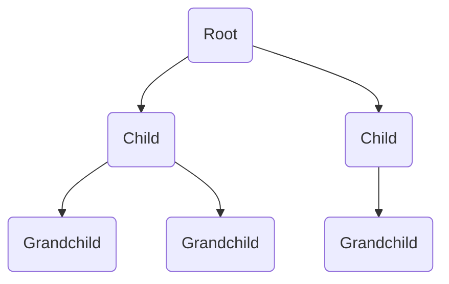
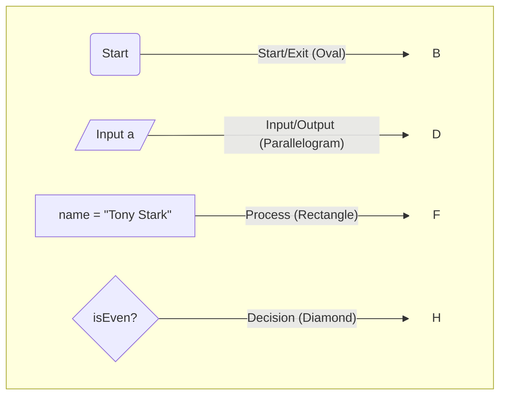
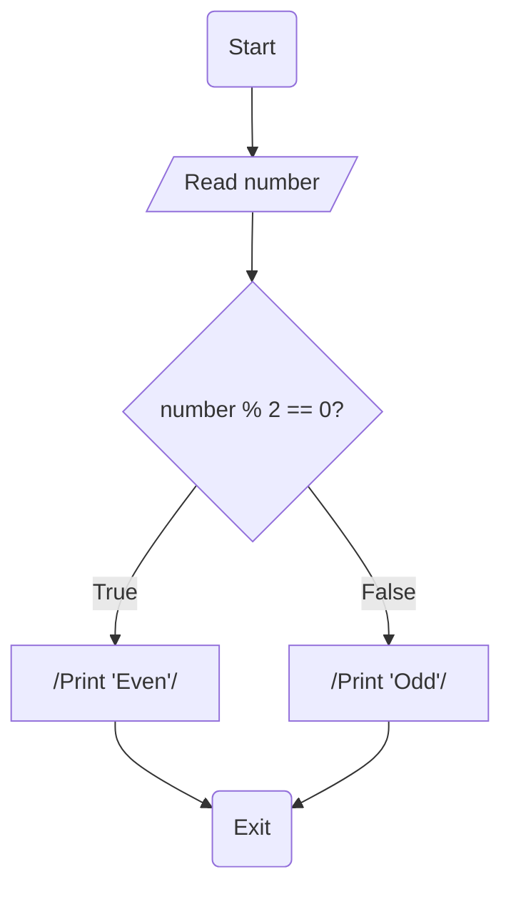

# 00. Fundamentals of Data Structures

This document provides a high-level overview of fundamental data structures, their classifications, and the basic operations associated with them.

## Classification of Data Structures

Data structures can be broadly classified into two main categories: Primitive and Non-Primitive. The chart below illustrates this hierarchy.



* **Primitive**: Basic data types that are built into the programming language (e.g., `int`, `float`, `char`).
* **Non-Primitive**: Complex data structures that are created by the programmer, often by combining primitive types.
  * **Linear**: Elements are arranged in a sequential or linear order.
  * **Non-Linear**: Elements are arranged in a hierarchical or networked fashion.

---

## Linear Data Structures

### 1. Array

An array is a collection of items stored at contiguous memory locations. It's a static structure, meaning its size is fixed at the time of creation.

* **Strength**: Fast, constant-time access to any element using its index (e.g., `array[5]`).
* **Weakness**: Fixed size. Inserting or deleting an element in the middle is slow because it requires shifting subsequent elements.



**Pseudocode Operations:**

```plaintext
// Accessing an element (O(1))
function get(array, index):
    return array[index]

// Searching for an element (O(n))
function search(array, value):
    for i from 0 to length(array) - 1:
        if array[i] == value:
            return i // return index
    return -1 // not found
```

### 2. Linked List

A linked list consists of nodes where each node contains data and a pointer to the next node in the sequence. It's a dynamic structure that can easily grow or shrink.

* **Strength**: Efficient insertion and deletion of elements without reorganizing the entire data structure.
* **Weakness**: Slow access and search. To find an element, you must traverse the list from the beginning (O(n)).



**Pseudocode Operations:**

```plaintext
// Inserting a node at the head (O(1))
function insertAtHead(list, newNode):
    newNode.next = list.head
    list.head = newNode

// Deleting a node (O(n) for search, O(1) for deletion itself)
function delete(list, value):
    if list.head.data == value:
        list.head = list.head.next
        return

    current = list.head
    while current.next is not null:
        if current.next.data == value:
            current.next = current.next.next
            return
        current = current.next
```

### 3. Stack

A stack is a **LIFO** (Last-In, First-Out) data structure. Think of it as a stack of plates: you add new plates to the top and also remove them from the top.

* **Common Uses**: Managing function calls (the call stack), undo/redo functionality, parsing expressions.



**Pseudocode Operations:**

```plaintext
// Add an element to the top (O(1))
function push(stack, element):
    stack.add_to_top(element)

// Remove and return the top element (O(1))
function pop(stack):
    return stack.remove_from_top()

// View the top element without removing it (O(1))
function peek(stack):
    return stack.get_top_element()
```

### 4. Queue

A queue is a **FIFO** (First-In, First-Out) data structure. Think of it as a checkout line: the first person to get in line is the first person to be served.

* **Common Uses**: Handling requests in order (e.g., a print queue), breadth-first search in graphs, task scheduling.



**Pseudocode Operations:**

```plaintext
// Add an element to the rear (O(1))
function enqueue(queue, element):
    queue.add_to_rear(element)

// Remove and return the front element (O(1))
function dequeue(queue):
    return queue.remove_from_front()
```

---

## Non-Linear Data Structures

### 1. Tree

A tree is a hierarchical structure consisting of a root node and subtrees of children with a parent-child relationship.

* **Common Uses**: File systems, representing hierarchical data (e.g., an organization chart), search trees (like Binary Search Trees) for efficient searching.



**Pseudocode Traversal (for a Binary Tree):**

```plaintext
// In-order traversal (Left, Root, Right)
function inorderTraversal(node):
    if node is null:
        return

    inorderTraversal(node.left)
    visit(node)
    inorderTraversal(node.right)
```

### 2. Graph

A graph is a collection of nodes (or vertices) connected by edges. The connections can be directed (one-way) or undirected (two-way).

* **Common Uses**: Social networks, mapping and navigation systems, computer networks.

```mermaid
graph TD
    subgraph "Undirected Graph"
        A -- B;
        B -- C;
        A -- C;
        A -- D;
    end
```

**Pseudocode Traversal (Breadth-First Search):**

```plaintext
// BFS explores neighbors first
function BFS(graph, startNode):
    queue = new Queue()
    visited = new Set()

    queue.enqueue(startNode)
    visited.add(startNode)

    while queue is not empty:
        currentNode = queue.dequeue()
        visit(currentNode)

        for each neighbor of currentNode:
            if neighbor is not visited:
                visited.add(neighbor)
                queue.enqueue(neighbor)
```

---

## Flowcharts and Pseudocode

Before writing code, it's often useful to plan the logic of a program. Flowcharts and pseudocode are two common tools for this.

* **Pseudocode**: A high-level, informal description of a program's logic, written in plain language. It focuses on the "what" not the "how."
* **Flowchart**: A visual diagram that represents the flow of logic in a program using standard symbols.

### Flowchart Components

These are the basic symbols used to create a flowchart.



| Shape | Name | Purpose |
| :--- | :--- | :--- |
| Oval | Start / Exit | Represents the beginning or end of a program. |
| Parallelogram | Input / Output | Used for getting input from a user or displaying output. |
| Rectangle | Process | Represents any processing or computation, like assigning a value. |
| Diamond | Decision | Used for a conditional step (e.g., an `if` statement) that branches into two or more paths. |
| Arrow | Connector | Shows the direction of logical flow between shapes. |

### Example: Check if a Number is Even or Odd

Here is how you would represent the logic for a simple program using both pseudocode and a flowchart.

### 1. Pseudocode

```plaintext
START
  DECLARE integer number
  PROMPT user to "Enter a number"
  READ number

  IF number % 2 == 0 THEN
    PRINT "The number is Even"
  ELSE
    PRINT "The number is Odd"
  END IF
END
```

### 2. Flowchart


