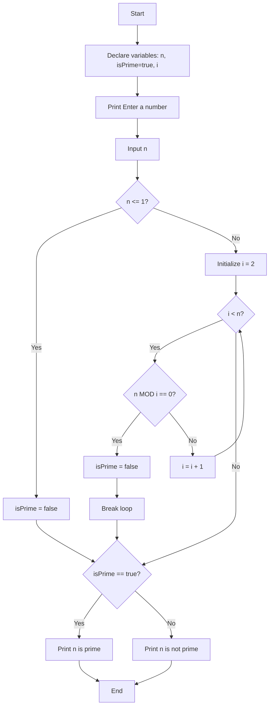

# 12. Prime Number Checker

This program determines whether a given number is prime or not. A prime number is a natural number greater than 1 that has no positive divisors other than 1 and itself.

## Algorithm

The program uses a simple trial division method:

1. Take input N from the user
2. Handle edge cases (numbers ≤ 1 are not prime)
3. Check if N is divisible by any number from 2 to N-1
4. If any divisor is found, N is not prime
5. If no divisors are found, N is prime

## Mathematical Definition

A number N is prime if and only if:

- N > 1
- N has no positive divisors other than 1 and N itself

## Pseudocode

```xml
BEGIN
    DECLARE n AS INTEGER
    DECLARE isPrime AS BOOLEAN = TRUE
    DECLARE i AS INTEGER
    
    PRINT "Enter a number: "
    INPUT n
    
    IF n <= 1 THEN
        isPrime = FALSE
    ELSE
        FOR i = 2 TO n-1 STEP 1
            IF n MOD i == 0 THEN
                isPrime = FALSE
                BREAK
            END IF
        END FOR
    END IF
    
    IF isPrime == TRUE THEN
        PRINT n + " is a prime number"
    ELSE
        PRINT n + " is not a prime number"
    END IF
END
```

## Flowchart



## Example Output

```xml
Enter a number: 17
17 is a prime number

Enter a number: 24
24 is not a prime number

Enter a number: 1
1 is not a prime number
```

## Time Complexity

- **Time Complexity**: O(n) - In the worst case, we check all numbers from 2 to n-1
- **Space Complexity**: O(1) - Constant space as we only use a few variables

## Optimization Opportunities

1. **Check only up to √n**: If n is not prime, it must have a divisor ≤ √n
2. **Skip even numbers**: After checking 2, only check odd numbers
3. **Sieve of Eratosthenes**: For checking multiple numbers efficiently
4. **Probabilistic tests**: For very large numbers (Miller-Rabin, etc.)

## Edge Cases Handled

- Numbers ≤ 1 are not prime
- 2 is the only even prime number
- All other even numbers > 2 are not prime

The current implementation is educational and demonstrates basic loop control and conditional logic.
