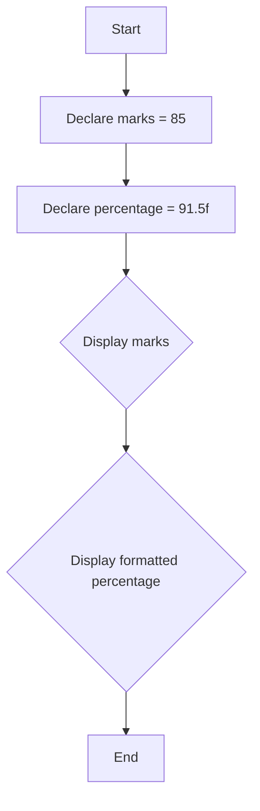

# 2. C++ Keywords and Identifiers

This section explains the concepts of keywords and identifiers in the C++ programming language, using the provided `main.cpp` as an example.

## Code Example

```cpp
#include <iostream>
#include <iomanip>

int main() {
    // 'marks' and 'percentage' are identifiers for variables.
    int marks = 85;
    float percentage = 91.5f;

    // 'std', 'cout', 'endl', 'fixed', and 'setprecision' are identifiers from the standard library.
    std::cout << "Marks = " << marks << std::endl;
    std::cout << "Percentage = " << std::fixed << std::setprecision(2) << percentage << "%" << std::endl;

    // 'return' is a keyword.
    return 0;
}
```

## Identifiers

In C++, an identifier is a name given to an entity like a variable, function, class, or structure. Identifiers are user-defined names. In the example above, `marks` and `percentage` are identifiers for variables.

### Rules for Naming Identifiers

1. An identifier can only be composed of letters (uppercase and lowercase), digits, and the underscore character `_`.
2. It must not start with a digit.
3. Keywords are not allowed to be used as identifiers.
4. C++ is case-sensitive, so `age` and `Age` would be treated as two different identifiers.
5. There's no length limit, but identifiers containing a double underscore (`__`) or starting with an underscore followed by a capital letter are reserved for the implementation. It's best to avoid them.

## Keywords

Keywords are predefined, reserved words in C++ that have special meanings to the compiler. These words are part of the language's syntax and cannot be used as identifiers.

In the example code, `int`, `float`, and `return` are keywords. C++ has significantly more keywords than C. Here is a partial list of common C++ keywords:

| `asm` | `else` | `new` | `this` |
|---|---|---|---|
| `auto` | `enum` | `operator` | `throw` |
| `bool` | `explicit` | `private` | `true` |
| `break` | `export` | `protected` | `try` |
| `case` | `extern` | `public` | `typedef` |
| `catch` | `false` | `register` | `typeid` |
| `char` | `float` | `reinterpret_cast` | `typename` |
| `class` | `for` | `return` | `union` |
| `const` | `friend` | `short` | `unsigned` |
| `const_cast` | `goto` | `signed` | `using` |
| `continue` | `if` | `sizeof` | `virtual` |
| `default` | `inline` | `static` | `void` |
| `delete` | `int` | `static_cast` | `volatile` |
| `do` | `long` | `struct` | `while` |
| `double` | `mutable` | `switch` | `namespace` |
| `dynamic_cast` | `template`| | |

## Pseudocode

```xml
BEGIN
    DECLARE INTEGER marks = 85
    DECLARE FLOAT percentage = 91.5f

    PRINT "Marks = " + marks
    PRINT "Percentage = " + formatted percentage + "%"
END
```

## Flowchart


