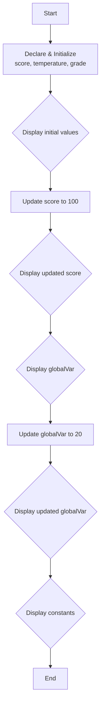

# 4. C++ Variables and Constants

This section covers the fundamentals of variables and constants in C++, with practical examples found in the `main.cpp` file.

## Variables

A variable is a name given to a storage area that our programs can manipulate. Each variable in C++ has a specific type, which determines the size and layout of the variable's memory.

### Key Concepts Illustrated in `main.cpp`

1. **Declaration and Initialization**:
    A variable is declared to specify its name and type. C++ offers several ways to initialize a variable.

    ```cpp
    int score = 95;           // C-style initialization
    float temperature(25.5f); // Constructor initialization
    char grade{'A'};          // Uniform initialization (often preferred in modern C++)
    ```

2. **Changing Variable Values**:
    The value of a variable can be changed anytime during program execution.

    ```cpp
    score = 100; // The value of score is now updated
    ```

3. **Scope**:
    The code demonstrates a `globalVar`, which is declared outside any function and can be accessed or modified anywhere in the program. Using global variables is generally discouraged in favor of better encapsulation. In contrast, variables declared inside `main()` (like `score`) are local to that function.

## Constants

A constant is an entity that refers to a fixed value; its value cannot be altered after initialization.

In C++, there are two primary ways to define constants:

### 1. The `const` Keyword

This creates a read-only variable whose value is determined at runtime. The compiler will ensure that the value of a `const` variable is not modified.

```cpp
const float GST_RATE = 0.18f;

// The following line would cause a compilation error:
// GST_RATE = 0.20f;
```

### 2. The `constexpr` Keyword (C++11 and later)

This declares that a value can be evaluated at **compile-time**. This is a powerful feature for optimization, as the calculation is done by the compiler, not by the program as it runs.

```cpp
constexpr int SIDES_OF_SQUARE = 4;
```

### 3. The `#define` Preprocessor Directive

This is a legacy method from C. It's a preprocessor macro that replaces every occurrence of the identifier with the defined literal value before compilation even begins. **It should be avoided in modern C++**.

```cpp
#define PI 3.14159 // Avoid this in C++
```

### `const`/`constexpr` vs. `#define`

| Feature | `const` / `constexpr` | `#define` |
|---|---|---|
| **Type Safety** | Are type-checked variables. | Is a simple text substitution; no type checking. |
| **Scope** | Obey standard C++ scoping rules (can be global, local, class members, etc.). | Has no scope; substitution happens everywhere after its definition. |
| **Debugging**| Appears in the debugger with its name. | The debugger only sees the literal value (e.g., `3.14159`), not `PI`. |
| **C++ Features** | Can be pointers, references, class members, etc. `constexpr` enables compile-time computation. | Cannot be used with many C++ features. |

**Conclusion**: Always prefer `const` or `constexpr` over `#define` in C++. Use `constexpr` for values that can be known at compile time, and `const` for values that are determined at runtime.

## Pseudocode

```xml
BEGIN
    DECLARE globalVar = 10

    // In main function
    DECLARE INTEGER score = 95
    DECLARE FLOAT temperature = 25.5f
    DECLARE CHARACTER grade = 'A'

    PRINT initial values of score, temperature, grade
    
    score = 100 // Update score
    PRINT updated value of score

    PRINT value of globalVar
    globalVar = 20 // Update globalVar
    PRINT updated value of globalVar

    // Constants
    DECLARE CONSTANT FLOAT GST_RATE = 0.18f
    DECLARE CONSTEXPR INTEGER SIDES_OF_SQUARE = 4
    PRINT value of constants
END
```

## Flowchart


