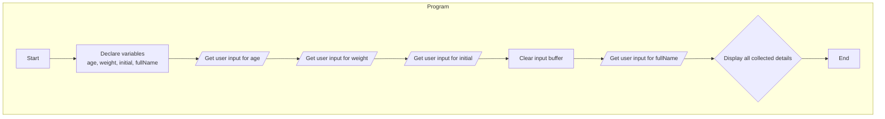

# 5. C++ I/O (`cin`, `cout`) and Comments

This section explains how to perform basic input and output operations in C++ using the I/O stream objects `std::cin` and `std::cout`, and how to use comments.

## Comments

Comments are notes within the code that are ignored by the compiler. They are used to explain what the code does. The syntax is identical to C.

1. **Single-line comments**: Start with `//`.
2. **Multi-line comments**: Start with `/*` and end with `*/`.

## Output: `std::cout`

The `std::cout` object ("character output stream") is used to send formatted output to the screen. It is used with the stream insertion operator `<<`.

- It can print simple strings: `std::cout << "Hello!";`
- It can print variables and chain multiple outputs together.
- `std::endl` is a manipulator that inserts a newline and flushes the output buffer.

```cpp
#include <iostream>
#include <iomanip> // Required for manipulators like setprecision

int age = 25;
float weight = 68.5f;
std::cout << "My age is: " << age << std::endl;
// std::fixed and std::setprecision(2) formats the float to 2 decimal places
std::cout << "Weight: " << std::fixed << std::setprecision(2) << weight << std::endl;
```

## Input: `std::cin`

The `std::cin` object ("character input stream") is used to read formatted input from the user. It uses the stream extraction operator `>>`.

```cpp
#include <iostream>

int age;
std::cout << "Enter your age: ";
std::cin >> age; // Reads an integer and stores it in the 'age' variable
```

### Important `cin` Considerations

- **Type Safety**: Unlike `scanf`, `cin` is type-safe. You don't need format specifiers, and it's much harder to cause a crash by passing the wrong type.
- **The Newline Issue**: The `>>` operator often leaves a newline character `\n` in the input buffer. This can cause the next input operation, especially if it's line-based, to fail.

## Reading Full Lines with `std::getline`

When you need to read input that may contain spaces (like a full name), the `>>` operator is unsuitable because it stops at the first whitespace. The correct tool is `std::getline`.

```cpp
#include <iostream>
#include <string>
#include <limits> // Required for std::numeric_limits

std::string fullName;
std::cout << "Enter your full name: ";

// This is a critical step to fix the newline issue!
// It tells cin to ignore any characters left in the buffer until it finds a newline.
std::cin.ignore(std::numeric_limits<std::streamsize>::max(), '\n'); 

// Now, getline will work as expected.
std::getline(std::cin, fullName);
```

## Full Code Example from `main.cpp`

```cpp
#include <iostream>
#include <string>
#include <iomanip>
#include <limits>

int main() {
    int age;
    float weight;
    char initial;
    std::string fullName;

    std::cout << "Enter your age: ";
    std::cin >> age;

    std::cout << "Enter your weight (in kg): ";
    std::cin >> weight;

    std::cout << "Enter your first initial: ";
    std::cin >> initial;

    std::cout << "Enter your full name: ";
    std::cin.ignore(std::numeric_limits<std::streamsize>::max(), '\n');
    std::getline(std::cin, fullName);

    std::cout << "\n--- Your Details ---" << std::endl;
    std::cout << "Full Name: " << fullName << std::endl;
    std::cout << "Initial: " << initial << std::endl;
    std::cout << "Age: " << age << " years old" << std::endl;
    std::cout << "Weight: " << std::fixed << std::setprecision(2) << weight << " kg" << std::endl;

    return 0;
}
```

## Pseudocode

```xml
BEGIN
    DECLARE INTEGER age
    DECLARE FLOAT weight
    DECLARE CHARACTER initial
    DECLARE STRING fullName

    PROMPT "Enter your age: "
    READ age

    PROMPT "Enter your weight (in kg): "
    READ weight

    PROMPT "Enter your first initial: "
    READ initial

    PROMPT "Enter your full name: "
    // Clear input buffer before reading line
    READ LINE fullName

    PRINT "--- Your Details ---"
    PRINT "Full Name: " + fullName
    PRINT "Initial: " + initial
    PRINT "Age: " + age
    PRINT "Weight: " + formatted weight
END
```

## Flowchart


