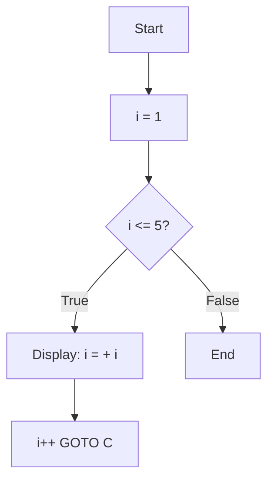
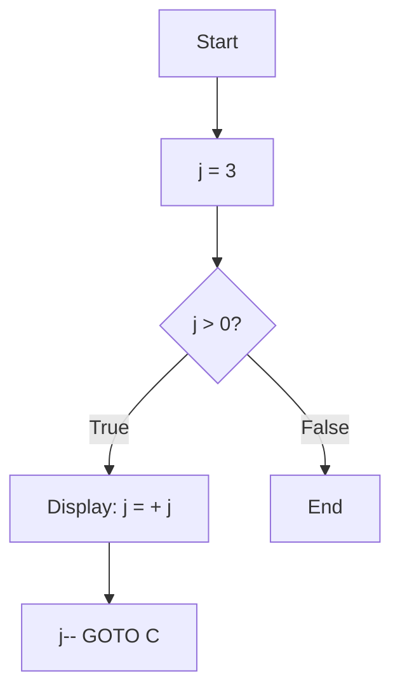
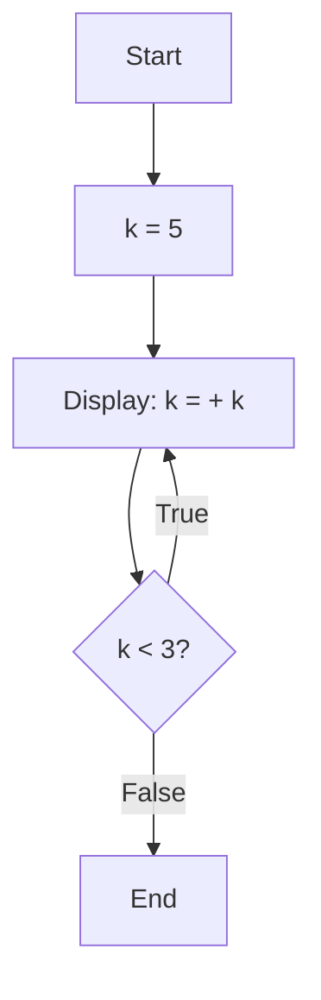

# 7. C++ Looping Statements

Loops are used to execute a block of code repeatedly as long as a certain condition is met. They are fundamental for automating repetitive tasks. The traditional `for`, `while`, and `do-while` loops are syntactically identical to C.

## 1. The `for` Loop

The `for` loop is ideal when you know how many times you want the loop to run. It consists of three parts: initialization, condition, and update.

**Syntax:**

```cpp
for (initialization; condition; update) {
    // Code to execute
}
```

**Example:** This loop runs 5 times.

```cpp
for (int i = 1; i <= 5; i++) {
    std::cout << "   i = " << i << std::endl;
}
```

## 2. The `while` Loop

The `while` loop repeatedly executes a block of code as long as a given condition remains true. It is an "entry-controlled" loop.

**Syntax:**

```cpp
while (condition) {
    // Code to execute
}
```

**Example:**

```cpp
int j = 3;
while (j > 0) {
    std::cout << "   j = " << j << std::endl;
    j--;
}
```

## 3. The `do-while` Loop

The `do-while` loop is an "exit-controlled" loop. It guarantees that the loop will run at least once.

**Syntax:**

```cpp
do {
    // Code to execute
} while (condition);
```

**Example:** This loop runs once, even though the condition `k < 3` is initially false.

```cpp
int k = 5;
do {
    std::cout << "   This runs at least once. k = " << k << std::endl;
} while (k < 3);
```

## 4. Range-Based `for` Loop (C++11 and later)

This is a major C++ enhancement for loops. It provides a much cleaner and safer way to iterate over all elements in a container (like an array, vector, or map).

**Syntax:**

```cpp
for (declaration : range_expression) {
    // Code to execute for each element
}
```

**Example:**

```cpp
#include <vector>
#include <iostream>

std::vector<int> numbers = {10, 20, 30, 40, 50};
for (int number : numbers) {
    std::cout << "   Value: " << number << std::endl;
}
```

This is generally preferred over a traditional `for` loop when you just need to access each element of a collection sequentially.

## 5. Loop Control Statements (`break` and `continue`)

These statements work identically in C++ to change a loop's execution.

- **`break`**: Immediately terminates the innermost loop.
- **`continue`**: Skips the rest of the current iteration and proceeds to the next.

**Example:**

```cpp
for (int num = 1; num <= 10; num++) {
    if (num % 2 == 0) {
        continue; // Skip even numbers
    }
    if (num > 7) {
        break; // Exit the loop
    }
    std::cout << "   Processed odd number: " << num << std::endl;
}
```

---

## `for` vs. `while` vs. `do-while` vs. Range-Based `for`

| Feature | `for` Loop | `while` Loop | `do-while` Loop | Range-Based `for` |
| :--- | :--- | :--- | :--- | :--- |
| **Primary Use Case** | When iteration count is known; index-based access. | When the loop depends on a complex condition. | When the loop must run at least once. | Iterating over every element of a container. |
| **Condition Check**| Entry-Controlled | Entry-Controlled | Exit-Controlled | (Handled internally) |
| **Safety** | Risk of off-by-one errors with index. | Risk of infinite loops if condition is not updated. | Risk of infinite loops. | Safest; no manual index or condition management. |
| **Readability** | Good for simple counting loops. | Good for condition-based loops. | Clear when "at least once" logic is needed. | Excellent for simple iteration. |

## Pseudocode

```xml
BEGIN
    // For Loop
    FOR i from 1 to 5
        PRINT "i = " + i
    END FOR

    // While Loop
    DECLARE j = 3
    WHILE j > 0
        PRINT "j = " + j
        DECREMENT j
    END WHILE

    // Do-While Loop
    DECLARE k = 5
    DO
        PRINT "This runs at least once. k = " + k
    WHILE k < 3

    // Range-Based For Loop
    DECLARE numbers = {10, 20, 30, 40, 50}
    FOR EACH number IN numbers
        PRINT "Value: " + number
    END FOR
END
```

## Flowcharts

### For Loop



### While Loop



### Do-While Loop


